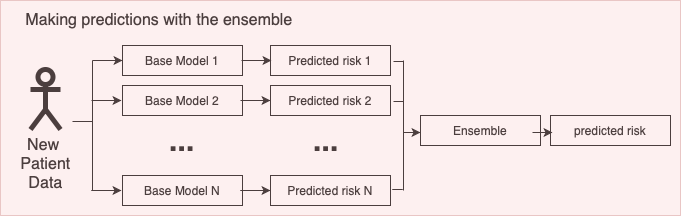

<!--
%\VignetteEngine{knitr}
%\VignetteIndexEntry{Building Ensemble Models}
-->
  
```{r setup, include=FALSE}
knitr::opts_chunk$set(echo = TRUE)
```

# Introduction
Ensemble models combine several models to improve the overall performance. Traditionally, weak learners were combined to boost performance but recent results show that combining several strong approaches can also result in a better performance. There are many examples in literature where ensemble models outperform individual models using stacking, i.e. a final logistic regression layer across the individual model outputs, but other approaches like weighting has also shown promising results. 

An ensemble model consists of a set of base models that make predictions and a mapping from the base model predictions to a single prediction (the ensemble strategy), see a visualization of this below.



This vignette describes how you can use the Observational Health Data Science and Informatics (OHDSI) [`EnsemblePatientLevelPrediction`](http://github.com/OHDSI/EnsemblePatientLevelPrediction) package to build ensemble models. This vignette assumes you have read and are comfortable with building single patient level prediction models as described in the  [`BuildingPredictiveModels` vignette](https://github.com/OHDSI/PatientLevelPrediction/blob/master/inst/doc/BuildingPredictiveModels.pdf).

This will enable studying ensemble methods at scale in the OHDSI data network.

In the EnsemblePatientLevelPrediction package, various ensemble strategies for combining base models have been implemented:
  
1. Uniform weighted ensemble: Calculate the average probability from individual models
2. Metric weighted ensemble: Calculate the weighted average probability from individual models using a metric such as cross validation AUROC as weights.
3. Stacked ensemble:  Train a logistics regression on outputs from individual models

In addition, it is possible to create custom ensemble combinators.

# Software Dependencies

To run EnsemblePatientLevelPrediction users will need to have a working version of the R package PatientLevelPrediction.

Certain models in PatientLevelPrediction depend on Python or Java.  If using Python/Java backend base models (e.g., KNN, adaBoost, randomForest, SVM, decisionTree) in your ensemble, please see instructions for configuring these in [this article](https://ohdsi.github.io/PatientLevelPrediction/articles/PatientLevelPrediction.html)

# Other Requirements

To develop ensemble models using EnsemblePatientLevelPrediction you need either:

- An OMOP CDM database with known connection settings that can be used to download data for the development of new models
- Multiple models developed using the PatientLevelPrediction (either loaded in R or saved in a directory).  These must be runPlp objects that contain the model, the internal predictions and the internal validation performance.

# Usage

To develop an ensemble you need to provide: 

1. The model designs or previously developed models - these are combined to create the ensemble
2. The filtering settings - these are rules used to determine whether a model should be included in the ensemble based on internal validation performance
3. The combination settings - these specify how to learn the process to combine the included models (e.g., via a uniform fusion, normalized AUROC or stacking)

A visualization of how an ensemble is developed can be seen below:


## Example 1: Developing a Fusion ensemble using a list of model designs

In this example we will show you how to develop an ensemble from scratch using an OMOP CDM database connection and model designs (created using the [`PatientLevelPrediction`](http://github.com/OHDSI/PatientLevelPrediction) `createModelDesign()` function).


### Database connection

We will use the `Eunomia` R package that contains an sql lite database with data in the OMOP CDM format for demonstration.

The following code initiates the Eunomia OMOP CDM database, configures the connectionDetails and then uses the `createDatabaseDetails()` in PatientLevelPrediction to specify where the data required when developing a prediction are found: 

```{r eval=FALSE}
connectionDetails <- Eunomia::getEunomiaConnectionDetails()
Eunomia::createCohorts(connectionDetails)

databaseDetails <- PatientLevelPrediction::createDatabaseDetails(
  connectionDetails = connectionDetails, 
  cdmDatabaseSchema = "main", cdmDatabaseId = 'eunomia',
  cohortDatabaseSchema = "main", 
  cohortTable = "cohort", 
  cohortId = 4, 
  outcomeIds = 3,
  outcomeDatabaseSchema = "main", 
  outcomeTable =  "cohort", 
  cdmDatabaseName = 'eunomia'
)
```


### Base Model Design 

The next step is designing the models that we wish to potentially combine via an ensemble.  To do this, we use the `createModelDesign()` function in PatientLevelPrediction.  This requires:

1. Specifying the cohortId for the target population
2. Specifying the outcomeId for the outcome
3. A specification of the candidate covariates (created using `FeatureExtraction::createCovariateSettings()`) that will be used by the model.
4. Any inclusion criteria implemented at data extraction specified via the `PatientLevelPrediction::createRestrictPlpDataSettings()` such as minimum observation time in the database (washoutPeriod) or whether the include patients multiple times in the data or restrict to the first cohort entry (firstExposureOnly).
5. Any inclusion criteria implemented after data extraction that can be specified via the `PatientLevelPrediction::createStudyPopulationSettings()` and specifications for the time-at-risk period to determine the outcome labels.
6. The model settings the specify which classifier/survival model to train and the hyper-parameter search.
7. The preprocessing settings specified by `PatientLevelPrediction::createPreprocessSettings()` where you can pick whether to normalize the data or remove rare/redundant covariates.

You can also optionally specify feature engineering settings and data sampling settings (e.g., over/under sampling).

### Model Design 1

For the first model we predict the outcome occurring within 2 years of the index date using a LASSO logistic regression model with demographic covariates plus conditions/drugs that occur in the year prior to index (but not included index):

```{r eval=FALSE}
# example model design 1

# 1. specify the cohort_definition_id for the target cohort
targetId <- 4

# 2. specify the cohort_definition_id for the outcome
outcomeId <- 3 

# 3. specify the covariates
# we include gender, age, race, ethnicity, age in 5 year groups,
# conditions groups (using the vocabulary hierarchy) in the past
# 365 days and drug ingredients in the past 365 days
# we do not include conditions/drugs that occur at index
covSet <- FeatureExtraction::createCovariateSettings(
  useDemographicsGender = T, 
  useDemographicsAge = T, 
  useDemographicsRace = T,
  useDemographicsEthnicity = T, 
  useDemographicsAgeGroup = T,
  useConditionGroupEraLongTerm = T, 
  useDrugEraStartLongTerm  = T, 
  endDays = -1
)

# 4. specify inclusion for data extraction
# we restrict to patients in the target cohort with >=365 days
# observation prior to index and only include patients once 
# (the first cohort entry)
restrictPlpDataSettings <- PatientLevelPrediction::createRestrictPlpDataSettings(
  firstExposureOnly = T, 
  washoutPeriod = 365
)

# 5. specify inclusion and time-at-risk
# We are predicting the outcome occurring from 1 day after index until
# 730 days after index.  We keep patients who drop out during the 
# time-at-risk.
populationSet <- PatientLevelPrediction::createStudyPopulationSettings(
  requireTimeAtRisk = F, 
  riskWindowStart = 1, 
  riskWindowEnd = 730
)

# 6. specify the model
# We train a default LASSO logistic regression model
modelSetting <- PatientLevelPrediction::setLassoLogisticRegression()

# 7. specify the preprocessing
# We use default preprocessing (normalize data and remove rare/redundant covariates)
preprocessSettings <- PatientLevelPrediction::createPreprocessSettings()

# input these into PatientLevelPrediction::createModelDesign
# this generates a modelDesign object
modelDesign1 <- PatientLevelPrediction::createModelDesign(
  targetId = targetId,
  outcomeId = outcomeId, 
  restrictPlpDataSettings = restrictPlpDataSettings,
  covariateSettings = covSet, 
  runCovariateSummary = F,
  modelSettings = modelSetting,
  populationSettings = populationSet, 
  preprocessSettings = preprocessSettings
)
```

### Model Design 2

For the second model we predict the outcome occurring within 2 years of the index date using a gradient boosting machine model with demographic covariates plus conditions/drugs that occur in the year prior to index (but not included index). The only difference between model design 1 and 2 is the model settings:

```{r eval=FALSE}
# example model design 2

# 1. specify the cohort_definition_id for the target cohort
targetId <- 4

# 2. specify the cohort_definition_id for the outcome
outcomeId <- 3 

# 3. specify the covariates
# we include gender, age, race, ethnicity, age in 5 year groups,
# conditions groups (using the vocabulary hierarchy) in the past
# 365 days and drug ingredients in the past 365 days
# we do not include conditions/drugs that occur at index
covSet <- FeatureExtraction::createCovariateSettings(
  useDemographicsGender = T, 
  useDemographicsAge = T, 
  useDemographicsRace = T,
  useDemographicsEthnicity = T, 
  useDemographicsAgeGroup = T,
  useConditionGroupEraLongTerm = T, 
  useDrugEraStartLongTerm  = T, 
  endDays = -1
)

# 4. specify inclusion for data extraction
# we restrict to patients in the target cohort with >=365 days
# observation prior to index and only include patients once 
# (the first cohort entry)
restrictPlpDataSettings <- PatientLevelPrediction::createRestrictPlpDataSettings(
  firstExposureOnly = T, 
  washoutPeriod = 365
)

# 5. specify inclusion and time-at-risk
# We are predicting the outcome occurring from 1 day after index until
# 730 days after index.  We keep patients who drop out during the 
# time-at-risk.
populationSet <- PatientLevelPrediction::createStudyPopulationSettings(
  requireTimeAtRisk = F, 
  riskWindowStart = 1, 
  riskWindowEnd = 730
)

# 6. specify the model
# We train a gradient boosting machine with default 
# hyper-parameter search
modelSetting <- PatientLevelPrediction::setGradientBoostingMachine()

# 7. specify the preprocessing
# We use default preprocessing (normalize data and remove rare/redundant covariates)
preprocessSettings <- PatientLevelPrediction::createPreprocessSettings()

modelDesign2 <- PatientLevelPrediction::createModelDesign(
  targetId = targetId,
  outcomeId = outcomeId, 
  restrictPlpDataSettings = restrictPlpDataSettings,
  covariateSettings = covSet, 
  runCovariateSummary = F,
  modelSettings = modelSetting,
  populationSettings = populationSet, 
  preprocessSettings = preprocessSettings
)
```

### Model Design 3

For the third model we predict the outcome occurring within 2 years of the index date using a LASSO logistic regression model (that includes the intercept in the regularization) with demographic covariates plus conditions/drugs/measurement indicators that occur in the year prior to index (but not included index). The differences between model design 1 and 3 is the inclusion of the intercept in the regularization and the addition of measurement indicator covariates:

```{r eval=FALSE}
# example model design 3

# 1. specify the cohort_definition_id for the target cohort
targetId <- 4

# 2. specify the cohort_definition_id for the outcome
outcomeId <- 3 

# 3. specify the covariates
# we include gender, age, race, ethnicity, age in 5 year groups,
# conditions groups (using the vocabulary hierarchy) in the past
# 365 days and drug ingredients in the past 365 days
# we do not include conditions/drugs that occur at index
# we also include measurements indicators in the past 365 days
covSet <- FeatureExtraction::createCovariateSettings(
  useDemographicsGender = T, 
  useDemographicsAge = T, 
  useDemographicsRace = T,
  useDemographicsEthnicity = T, 
  useDemographicsAgeGroup = T,
  useConditionGroupEraLongTerm = T, 
  useDrugEraStartLongTerm  = T, 
  useMeasurementLongTerm = T,
  endDays = -1
)

# 4. specify inclusion for data extraction
# we restrict to patients in the target cohort with >=365 days
# observation prior to index and only include patients once 
# (the first cohort entry)
restrictPlpDataSettings <- PatientLevelPrediction::createRestrictPlpDataSettings(
  firstExposureOnly = T, 
  washoutPeriod = 365
)

# 5. specify inclusion and time-at-risk
# We are predicting the outcome occurring from 1 day after index until
# 730 days after index.  We keep patients who drop out during the 
# time-at-risk.
populationSet <- PatientLevelPrediction::createStudyPopulationSettings(
  requireTimeAtRisk = F, 
  riskWindowStart = 1, 
  riskWindowEnd = 730
)

# 6. specify the model
# We train a LASSO logistic regression model but include the 
# intercept in the regularization
modelSetting <- PatientLevelPrediction::setLassoLogisticRegression(
  forceIntercept = T
  )

# 7. specify the preprocessing
# We use default preprocessing (normalize data and remove rare/redundant covariates)
preprocessSettings <- PatientLevelPrediction::createPreprocessSettings()

modelDesign3 <- PatientLevelPrediction::createModelDesign(
  targetId = targetId,
  outcomeId = outcomeId, 
  restrictPlpDataSettings = restrictPlpDataSettings,
  covariateSettings = covSet, 
  runCovariateSummary = F,
  modelSettings = modelSetting,
  populationSettings = populationSet, 
  preprocessSettings = preprocessSettings
)

```

In this example we use three base models, but it is possible to add as many base models as desired.  

### Ensemble Strategy

Once you have specified the databaseDetails and defined all the base model designs, the next step is specifying the split settings (how much data will be used to develop each base model and how much is used to test the base models/ensemble) and the ensemble strategy, consisting of a filtering setting and a combination setting.

The default split settings is `PatientLevelPrediction::createDefaultSplitSetting()` splits the data randomly (by stratified by outcome label) into 25% test data and 75% train data.  The train data is split into 3 folds for cross validation.  This is a suitable split for most ensembles.

In this example we use the default split settings:

```{r eval=FALSE}

splitSettings <- PatientLevelPrediction::createDefaultSplitSetting()

```

The filter settings specify criteria for including a base model in the ensemble.  It is a list with the options:

1. `metric` - the metric to use when extracting the internal performance
2. `evaluation` - either 'CV' or 'Train' specifying which internal performance evaluation type to use
3. `minValue` - if this is set then a base model's `metric` for the `evaluation` is extracted and the base model is included into the ensemble if this value is greater or equal to `minValue`.
3. `maxValue` - if this is set then a base model's `metric` for the `evaluation` is extracted and the base model is included into the ensemble if this value is lesser or equal to `maxValue`.

In this example we will only include base models where the internal cross validation AUROC is between 0.5 and 1:

```{r eval=FALSE}

filterSettings <- list(
    metric = 'AUROC',
    evaluation = 'CV',
    minValue = 0.5, 
    maxValue = 1
    )
```

The final setting is how to combine the base model that pass the filter.  This is specified by creating a `combinerSettings` object.  This can be create in a custom way, or you can select from some default functions to create this.  The main one is: `EnsemblePatientLevelPrediction::createFusionCombiner` that can do uniform weights or weights based on internal validation metrics. 

The specify a combiner that takes the mean of all the included base model predictions, pick `type = uniform` and `scaleFunction = 'normalize'`.  Alternatively, if you wished to weight the base models based on internal validation performance, you need to specify the `evaluation` where you can select 'CV' or 'Train'.  Then you need to specify the metric `type` (e.g., `type = 'AUROC'` or `type = 'AUPRC'`).  The `scaleFunction = 'normalize'` makes sure the weights add to 1.

In this example we will use equal weighting for the base models but want to make sure the weights add up to 1, so we pick:

```{r eval=FALSE}
combinerSettings <- EnsemblePatientLevelPrediction::createFusionCombiner(
    type = 'uniform',
    scaleFunction = 'normalize'
  )
```

Finally, putting all these together, we run the `EnsemblePatientLevelPrediction::setEnsembleFromDesign()` function to create the ensemble settings:

```{r eval=FALSE}
ensembleSettings <- EnsemblePatientLevelPrediction::setEnsembleFromDesign(
  modelDesignList = list(modelDesign1, modelDesign2, modelDesign3),
  databaseDetails = databaseDetails,
  splitSettings = splitSettings,
  filterSettings = filterSettings,
  combinerSettings = combinerSettings
)
```


### Running The Ensemble Development

The final step is now running the ensemble development.  This requires the ensemble setting, a log setting (specifying what progress text is output during the ensemble development) and the location to save the ensemble.  In this example we use the previously specified ensemble settings, we create a log setting named 'ensemble' and we save the ensemble to a directory named 'testingEnsemble' within the current working directory.

```{r eval=FALSE}
ensemble <- EnsemblePatientLevelPrediction::runEnsemble(
  ensembleSettings = ensembleSettings,
  logSettings = PatientLevelPrediction::createLogSettings(logName = 'ensemble'),
  saveDirectory = './testingEnsemble'
)

```

If all the settings are specified correctly, you will see progress text telling you the data are being extracted, then telling you each base model is being developed and finally telling you the evaluation of the base models and the ensemble.  The result will be `ensemble` that is an object of class `plpEnsemble` containing:

1. model - the ensemble model
2. prediction - a data.frame with the predictions for the ensemble and base models
3. performanceEvaluation - a list of objects with the internal validation of the base models and ensemble
4. analysisSettings - the analysisId for the ensemble
5. executionSettings - information about the execution of the ensemble development

The function `EnsemblePatientLevelPrediction::runEnsemble()` will save the ensemble result in the directory specified by `saveDirectory`, but you can save it somewhere else by running:

```{r eval=FALSE}

EnsemblePatientLevelPrediction::saveEnsemble(
  ensemble,
  'C:/any/location/here'
)

```


## Example 2: Developing a stacker ensemble using a list of model designs

In this example we will show you how to develop a stacker ensemble from scratch using an OMOP CDM database connection and model designs (created using the [`PatientLevelPrediction`](http://github.com/OHDSI/PatientLevelPrediction) createModelDesign() function).


### Database connection

We will use the `Eunomia` R package that contains an sql lite database with data in the OMOP CDM format for demonstration.

The following code initiates the Eunomia OMOP CDM database, configures the connectionDetails and then uses the `createDatabaseDetails()` in PatientLevelPrediction to specify where the data required when developing a prediction are found: 

```{r eval=FALSE}
connectionDetails <- Eunomia::getEunomiaConnectionDetails()
Eunomia::createCohorts(connectionDetails)

databaseDetails <- PatientLevelPrediction::createDatabaseDetails(
  connectionDetails = connectionDetails, 
  cdmDatabaseSchema = "main", cdmDatabaseId = 'eunomia',
  cohortDatabaseSchema = "main", 
  cohortTable = "cohort", 
  cohortId = 4, 
  outcomeIds = 3,
  outcomeDatabaseSchema = "main", 
  outcomeTable =  "cohort", 
  cdmDatabaseName = 'eunomia'
)
```


### Base Model Design 

The next step is designing the models that we wish to potentially combine via an ensemble.  To do this, we use the `createModelDesign()` function in PatientLevelPrediction.  This requires:

1. Specifying the cohortId for the target population
2. Specifying the outcomeId for the outcome
3. A specification of the candidate covariates (created using `FeatureExtraction::createCovariateSettings()`) that will be used by the model.
4. Any inclusion criteria implemented at data extraction specified via the `PatientLevelPrediction::createRestrictPlpDataSettings()` such as minimum observation time in the database (washoutPeriod) or whether the include patients multiple times in the data or restrict to the first cohort entry (firstExposureOnly).
5. Any inclusion criteria implemented after data extraction that can be specified via the `PatientLevelPrediction::createStudyPopulationSettings()` and specifications for the time-at-risk period to determine the outcome labels.
6. The model settings the specify which classifier/survival model to train and the hyper-parameter search.
7. The preprocessing settings specified by `PatientLevelPrediction::createPreprocessSettings()` where you can pick whether to normalize the data or remove rare/redundant covariates.

You can also optionally specify feature engineering settings and data sampling settings (e.g., over/under sampling).

### Model Design 1

For the first model we predict the outcome occurring within 2 years of the index date using a LASSO logistic regression model with demographic covariates plus conditions/drugs that occur in the year prior to index (but not included index):

```{r eval=FALSE}
# example model design 1

# 1. specify the cohort_definition_id for the target cohort
targetId <- 4

# 2. specify the cohort_definition_id for the outcome
outcomeId <- 3 

# 3. specify the covariates
# we include gender, age, race, ethnicity, age in 5 year groups,
# conditions groups (using the vocabulary hierarchy) in the past
# 365 days and drug ingredients in the past 365 days
# we do not include conditions/drugs that occur at index
covSet <- FeatureExtraction::createCovariateSettings(
  useDemographicsGender = T, 
  useDemographicsAge = T, 
  useDemographicsRace = T,
  useDemographicsEthnicity = T, 
  useDemographicsAgeGroup = T,
  useConditionGroupEraLongTerm = T, 
  useDrugEraStartLongTerm  = T, 
  endDays = -1
)

# 4. specify inclusion for data extraction
# we restrict to patients in the target cohort with >=365 days
# observation prior to index and only include patients once 
# (the first cohort entry)
restrictPlpDataSettings <- PatientLevelPrediction::createRestrictPlpDataSettings(
  firstExposureOnly = T, 
  washoutPeriod = 365
)

# 5. specify inclusion and time-at-risk
# We are predicting the outcome occurring from 1 day after index until
# 730 days after index.  We keep patients who drop out during the 
# time-at-risk.
populationSet <- PatientLevelPrediction::createStudyPopulationSettings(
  requireTimeAtRisk = F, 
  riskWindowStart = 1, 
  riskWindowEnd = 730
)

# 6. specify the model
# We train a default LASSO logistic regression model
modelSetting <- PatientLevelPrediction::setLassoLogisticRegression()

# 7. specify the preprocessing
# We use default preprocessing (normalize data and remove rare/redundant covariates)
preprocessSettings <- PatientLevelPrediction::createPreprocessSettings()

# input these into PatientLevelPrediction::createModelDesign
# this generates a modelDesign object
modelDesign1 <- PatientLevelPrediction::createModelDesign(
  targetId = targetId,
  outcomeId = outcomeId, 
  restrictPlpDataSettings = restrictPlpDataSettings,
  covariateSettings = covSet, 
  runCovariateSummary = F,
  modelSettings = modelSetting,
  populationSettings = populationSet, 
  preprocessSettings = preprocessSettings
)
```

### Model Design 2

For the second model we predict the outcome occurring within 2 years of the index date using a gradient boosting machine model with demographic covariates plus conditions/drugs that occur in the year prior to index (but not included index). The only difference between model design 1 and 2 is the model settings:

```{r eval=FALSE}
# example model design 2

# 1. specify the cohort_definition_id for the target cohort
targetId <- 4

# 2. specify the cohort_definition_id for the outcome
outcomeId <- 3 

# 3. specify the covariates
# we include gender, age, race, ethnicity, age in 5 year groups,
# conditions groups (using the vocabulary hierarchy) in the past
# 365 days and drug ingredients in the past 365 days
# we do not include conditions/drugs that occur at index
covSet <- FeatureExtraction::createCovariateSettings(
  useDemographicsGender = T, 
  useDemographicsAge = T, 
  useDemographicsRace = T,
  useDemographicsEthnicity = T, 
  useDemographicsAgeGroup = T,
  useConditionGroupEraLongTerm = T, 
  useDrugEraStartLongTerm  = T, 
  endDays = -1
)

# 4. specify inclusion for data extraction
# we restrict to patients in the target cohort with >=365 days
# observation prior to index and only include patients once 
# (the first cohort entry)
restrictPlpDataSettings <- PatientLevelPrediction::createRestrictPlpDataSettings(
  firstExposureOnly = T, 
  washoutPeriod = 365
)

# 5. specify inclusion and time-at-risk
# We are predicting the outcome occurring from 1 day after index until
# 730 days after index.  We keep patients who drop out during the 
# time-at-risk.
populationSet <- PatientLevelPrediction::createStudyPopulationSettings(
  requireTimeAtRisk = F, 
  riskWindowStart = 1, 
  riskWindowEnd = 730
)

# 6. specify the model
# We train a gradient boosting machine with default 
# hyper-parameter search
modelSetting <- PatientLevelPrediction::setGradientBoostingMachine()

# 7. specify the preprocessing
# We use default preprocessing (normalize data and remove rare/redundant covariates)
preprocessSettings <- PatientLevelPrediction::createPreprocessSettings()

modelDesign2 <- PatientLevelPrediction::createModelDesign(
  targetId = targetId,
  outcomeId = outcomeId, 
  restrictPlpDataSettings = restrictPlpDataSettings,
  covariateSettings = covSet, 
  runCovariateSummary = F,
  modelSettings = modelSetting,
  populationSettings = populationSet, 
  preprocessSettings = preprocessSettings
)
```

### Model Design 3

For the third model we predict the outcome occurring within 2 years of the index date using a LASSO logistic regression model (that includes the intercept in the regularization) with demographic covariates plus conditions/drugs/measurement indicators that occur in the year prior to index (but not included index). The differences between model design 1 and 3 is the inclusion of the intercept in the regularization and the addition of measurement indicator covariates:

```{r eval=FALSE}
# example model design 3

# 1. specify the cohort_definition_id for the target cohort
targetId <- 4

# 2. specify the cohort_definition_id for the outcome
outcomeId <- 3 

# 3. specify the covariates
# we include gender, age, race, ethnicity, age in 5 year groups,
# conditions groups (using the vocabulary hierarchy) in the past
# 365 days and drug ingredients in the past 365 days
# we do not include conditions/drugs that occur at index
# we also include measurements indicators in the past 365 days
covSet <- FeatureExtraction::createCovariateSettings(
  useDemographicsGender = T, 
  useDemographicsAge = T, 
  useDemographicsRace = T,
  useDemographicsEthnicity = T, 
  useDemographicsAgeGroup = T,
  useConditionGroupEraLongTerm = T, 
  useDrugEraStartLongTerm  = T, 
  useMeasurementLongTerm = T,
  endDays = -1
)

# 4. specify inclusion for data extraction
# we restrict to patients in the target cohort with >=365 days
# observation prior to index and only include patients once 
# (the first cohort entry)
restrictPlpDataSettings <- PatientLevelPrediction::createRestrictPlpDataSettings(
  firstExposureOnly = T, 
  washoutPeriod = 365
)

# 5. specify inclusion and time-at-risk
# We are predicting the outcome occurring from 1 day after index until
# 730 days after index.  We keep patients who drop out during the 
# time-at-risk.
populationSet <- PatientLevelPrediction::createStudyPopulationSettings(
  requireTimeAtRisk = F, 
  riskWindowStart = 1, 
  riskWindowEnd = 730
)

# 6. specify the model
# We train a LASSO logistic regression model but include the 
# intercept in the regularization
modelSetting <- PatientLevelPrediction::setLassoLogisticRegression(
  forceIntercept = T
  )

# 7. specify the preprocessing
# We use default preprocessing (normalize data and remove rare/redundant covariates)
preprocessSettings <- PatientLevelPrediction::createPreprocessSettings()

modelDesign3 <- PatientLevelPrediction::createModelDesign(
  targetId = targetId,
  outcomeId = outcomeId, 
  restrictPlpDataSettings = restrictPlpDataSettings,
  covariateSettings = covSet, 
  runCovariateSummary = F,
  modelSettings = modelSetting,
  populationSettings = populationSet, 
  preprocessSettings = preprocessSettings
)

```

In this example we use three base models, but it is possible to add as many base models as desired.  

### Ensemble Strategy

Once you have specified the databaseDetails and defined all the base model designs, the next step is specifying the split settings (how much data will be used to develop each base model and how much is used to test the base models/ensemble) and the ensemble strategy, consisting of a filtering setting and a combination setting.

As we are using a stacker, we will split the data into:
- training data for the level 1 base models
- training data for the level 2 stacker model
- testing data for the ensemble


The default split settings `PatientLevelPrediction::createDefaultSplitSetting()` splits the data randomly (by stratified by outcome label) into 25\% test data and 75\% train data.  The train data is split into 3 folds for cross validation.  

For the stacker, the train data will be used by the level 1 base models and the test data will further split into data used to train the level 2 stacker model and the remaining will be used perform internal validation for the ensemble. Therefore, we will split the data into 50\% level 1 training data and 50\% test data (that will be split into 25\% level 2 training data and 25\% ensemble test data based on the input to `createStackerCombiner()`)

```{r eval=FALSE}

splitSettings <- PatientLevelPrediction::createDefaultSplitSetting(
  testFraction = 0.5, 
  trainFraction = 0.5
  )

```

The filter settings specify criteria for including a base model in the ensemble.  It is a list with the options:

1. `metric` - the metric to use when extracting the internal performance
2. `evaluation` - either 'CV' or 'Train' specifying which internal performance evaluation type to use
3. `minValue` - if this is set then a base model's `metric` for the `evaluation` is extracted and the base model is included into the ensemble if this value is greater or equal to `minValue`.
3. `maxValue` - if this is set then a base model's `metric` for the `evaluation` is extracted and the base model is included into the ensemble if this value is lesser or equal to `maxValue`.

In this example we will only include base models where the internal cross validation AUROC is between 0.5 and 1:

```{r eval=FALSE}

filterSettings <- list(
    metric = 'AUROC',
    evaluation = 'CV',
    minValue = 0.5, 
    maxValue = 1
    )
```

The final setting is how to combine the base model that pass the filter.  This is specified by creating a `combinerSettings` object.  This can be create in a custom way, or you can select from some default functions to create this.  The default stacker function is: `EnsemblePatientLevelPrediction::createStackerCombiner`. 

The inputs for the `EnsemblePatientLevelPrediction::createStackerCombiner` are:

- a string `levelTwoType` that corresponds to the classifier that will be used to learn to combine the level 1 base predictions.  Currently only 'logisticRegressionStacker' a logistic model stacker is supported.  
- a list `levelTwoHyperparameters` containing any hyper-parameters for the level two stacker.  For 'logisticRegressionStacker' this is NULL as there are no hyper-parameters for logistic regression.
- a list `levelTwoDataSettings` that specifies whether the stacker will be learned using the 'CV' predictions or 'Test' predictions.  If using 'Test' then a proportion is requires to specify what proprotion of the 'Test' predictions will be used to learn the level 2 stacker model and the remainingn 'Test' predictions will be used to calculate the internal validation performance.


```{r eval=FALSE}
combinerSettings <- EnsemblePatientLevelPrediction::createStackerCombiner(
  levelTwoType = 'logisticRegressionStacker',
  levelTwoDataSettings = list(
    type = 'Test', 
    proportion = 0.5
    )
)

# if you have smaller data and you dont want to split the Test data into two, you can train the stacker on the CV predictions using:

combinerSettings2 <- EnsemblePatientLevelPrediction::createStackerCombiner(
  levelTwoType = 'logisticRegressionStacker',
  levelTwoDataSettings = list(type = 'CV')
)

```

Finally, putting all these together, we run the `EnsemblePatientLevelPrediction::setEnsembleFromDesign()` function to create the ensemble settings:

```{r eval=FALSE}
ensembleSettings <- EnsemblePatientLevelPrediction::setEnsembleFromDesign(
  modelDesignList = list(modelDesign1, modelDesign2, modelDesign3),
  databaseDetails = databaseDetails,
  splitSettings = splitSettings,
  filterSettings = filterSettings,
  combinerSettings = combinerSettings
)
```


### Running The Ensemble Development

The final step is now running the ensemble development.  This requires the ensemble setting, a log setting (specifying what progress text is output during the ensemble development) and the location to save the ensemble.  In this example we use the previously specified ensemble settings, we create a log setting named 'ensemble' and we save the ensemble to a directory named 'testingEnsemble' within the current working directory.

```{r eval=FALSE}
ensemble <- EnsemblePatientLevelPrediction::runEnsemble(
  ensembleSettings = ensembleSettings,
  logSettings = PatientLevelPrediction::createLogSettings(logName = 'ensemble'),
  saveDirectory = './testingEnsemble'
)

```

If all the settings are specified correctly, you will see progress text telling you the data are being extracted, then telling you each base model is being developed and finally telling you the evaluation of the base models and the ensemble.  The result will be `ensemble` that is an object of class `plpEnsemble` containing:

1. model - the ensemble model
2. prediction - a data.frame with the predictions for the ensemble and base models
3. performanceEvaluation - a list of objects with the internal validation of the base models and ensemble
4. analysisSettings - the analysisId for the ensemble
5. executionSettings - information about the execution of the ensemble development

The function `EnsemblePatientLevelPrediction::runEnsemble()` will save the ensemble result in the directory specified by `saveDirectory`, but you can save it somewhere else by running:

```{r eval=FALSE}

EnsemblePatientLevelPrediction::saveEnsemble(
  ensemble,
  'C:/any/location/here'
)

```


## Example 3: Developing a Fusion ensemble using a list of runPlp objects

In this example we show you how you can develop an ensemble using previously developed base models (maybe you have developed models previously and wish to combine them).  This can be used to combine models developed using different databases.

You will need:

- A list of runPlp objects created using the [`PatientLevelPrediction`](http://github.com/OHDSI/PatientLevelPrediction) runPlp() function. The runPlp objects containing the prediction models you wish to combine and their internal validation performances.

### Creating the resultList

```{r eval=FALSE}

# if you have a runPLP result at runPlpLocation1, load it into R
result1 <- PatientLevelPrediction::loadPlpResult(runPlpLocation1)

# if you have a runPLP result at runPlpLocation2, load it into R
result2 <- PatientLevelPrediction::loadPlpResult(runPlpLocation2)

# if you have a runPLP result at runPlpLocation3, load it into R
result3 <- PatientLevelPrediction::loadPlpResult(runPlpLocation3)

# if you have a runPLP result at runPlpLocation4, load it into R
result4 <- PatientLevelPrediction::loadPlpResult(runPlpLocation4)

resultList <- list(
  result1,
  result2,
  result3,
  result4
)

```

### Ensemble Strategy

Once you have the resultList you then need to specify the ensemble strategy, consisting of a filtering setting and a combination setting.

The filter settings specify criteria for including a base model in the ensemble.  It is a list with the options:

1. `metric` - the metric to use when exrtracting the internal performance
2. `evaluation` - either 'CV' or 'Train' specifying which internal performance evaluation type to use
3. `minValue` - if this is set then a base model's `metric` for the `evaluation` is extracted and the base model is included into the ensemble if this value is greater or equal to `minValue`.
3. `maxValue` - if this is set then a base model's `metric` for the `evaluation` is extracted and the base model is included into the ensemble if this value is lesser or equal to `maxValue`.

In this example we will only include base models where the internal cross validation AUROC is between 0.5 and 1:

```{r eval=FALSE}

filterSettings <- list(
    metric = 'AUROC',
    evaluation = 'CV',
    minValue = 0.5, 
    maxValue = 1
    )
```

The final setting is how to combine the base model that pass the filter.  This is specified by creating a `combinerSettings` object.  This can be create in a custom way, or you can select from some default functions to create this.  The main one is: `EnsemblePatientLevelPrediction::createFusionCombiner` that can do uniform weights or weights based on internal validation metrics. 

The specify a combiner that takes the mean of all the included base model predictions, pick `type = uniform` and `scaleFunction = 'normalize'`.  Alternatively, if you wished to weight the base models based on internal validation performance, you need to specify the `evaluation` where you can select 'CV' or 'Train'.  Then you need to specify the metric `type` (e.g., `type = 'AUROC'` or `type = 'AUPRC'`).  The `scaleFunction = 'normalize'` makes sure the weights add to 1.

In this example we will use normalized AUROC based on cross validation weighting for the base models but want to make sure the weights add up to 1, so we pick:

```{r eval=FALSE}
combinerSettings <- EnsemblePatientLevelPrediction::createFusionCombiner(
    type = 'AUROC',
    evaluation = 'CV',
    scaleFunction = 'normalize'
  )
```

Finally, putting all these together, we run the `EnsemblePatientLevelPrediction::setEnsembleFromDesign()` function to create the ensemble settings:

```{r eval=FALSE}
ensembleSettings <- EnsemblePatientLevelPrediction::setEnsembleFromResults(
  resultList = resultList,
  filterSettings = filterSettings,
  combinerSettings = combinerSettings
)
```


### Running The Ensemble Development

The final step is now running the ensemble development.  This requires the ensemble setting, a log setting (specifying what progress text is output during the ensemble development) and the location to save the ensemble.  In this example we use the previously specified ensemble settings, we create a log setting named 'ensemble' and we save the ensemble to a directory named 'testingEnsemble' within the current working directory.

```{r eval=FALSE}
ensemble <- EnsemblePatientLevelPrediction::runEnsemble(
  ensembleSettings = ensembleSettings,
  logSettings = PatientLevelPrediction::createLogSettings(logName = 'ensemble'),
  saveDirectory = './testingEnsemble2'
)

```

If all the settings are specified correctly, you will see progress text reporting the evaluation performance of the base models and the ensemble.  

When creating an ensemble using a list of `runPlp` objects the output `ensemble` can be an object of class `plpEnsemble` or an object of class `ensembleModel`.  If the runPlp objects have all been developed using the same target population, with the same test/train split, then the test set can be used to evaluate the ensemble, so you will get an object of class `plpEnsemble`.  However, if the runPlp objects were trained using different target populations (such as using different databases), then it is not possible to evaluate the ensemble using the resultList, so only the ensemble model, an object of class `ensembleModel`, will be returned.

An object of class `plpEnsemble` contains:

1. model - the ensemble model
2. prediction - a data.frame with the predictions for the ensemble and base models
3. performanceEvaluation - a list of objects with the internal validation of the base models and ensemble
4. analysisSettings - the analysisId for the ensemble
5. executionSettings - information about the execution of the ensemble development

An object of class `ensembleModel` contains:

1. model - a list with the ensemble and baseModels
2. trainDetails - a list with training details
3. settings - the combination settings
4. covariateImportance - an empty data.frame


## Saving and loading the ensemble model

You can save and load the ensemble result using:
  
```{r tidy=TRUE,eval=FALSE}
saveEnsemble(
  ensembleResults, 
  dirPath = file.path(getwd(),'ensemble')
  )

ensembleResult <- loadEnsemble(file.path(getwd(),'ensemble'))
```

You can save and load the ensemble model result using:
  
```{r tidy=TRUE,eval=FALSE}
saveEnsembleModel(
  ensembleResults$model, 
  dirPath = file.path(getwd(),'ensembleModel')
  )

ensembleModel <- loadEnsembleModel(file.path(getwd(),'ensembleModel'))
```


# Apply Ensemble model

To apply the ensemble to new data:

```{r eval=FALSE}

newDatabaseDetails <- PatientLevelPrediction::createDatabaseDetails(
  connectionDetails = 'add new connection details',
)

ensembleModel <- EnsemblePatientLevelPrediction::loadEnsembleModel(
  file.path(getwd(),'ensembleModel')
)
ensemblePrediction <- applyEnsemble(
  ensembleModel = ensembleModel,
  newDatabaseDetails = newDatabaseDetails,
  logSettings = PatientLevelPrediction::createLogSettings(),
  outputFolder = 'C:/locationToSaveBaseModelResults'
)

```

# Demo

We have added a demo of the ensemble training:
  
``` {r eval=FALSE}
# Run the Ensemble demo
demo("EnsembleModelDemo", package = "EnsemblePatientLevelPrediction")
```
# Acknowledgments

Considerable work has been dedicated to provide the `EnsemblePatientLevelPrediction` package.

```{r tidy=TRUE,eval=TRUE}
citation("PatientLevelPrediction")
```

**Please reference this paper if you use the PLP Package in your work:**
  
[Reps JM, Schuemie MJ, Suchard MA, Ryan PB, Rijnbeek PR. Design and implementation of a standardized framework to generate and evaluate patient-level prediction models using observational healthcare data. J Am Med Inform Assoc. 2018;25(8):969-975.](http://dx.doi.org/10.1093/jamia/ocy032)